# 오차역전파법

수치 미분
- 장점 : 단순하고 구현하기 쉬움   
- 단점 : 수치 미분계산 시간이 오래 걸림   

## 계산 그래프

계산 과정을 그래프로 나타낸 것   
`노드(node)`와 `엣지(edge)`로 표현   
- 노드는 연산을 정의
- 엣지는 데이터가 흘러가는 방향을 나타냄

### 계산 그래프 방법

**예제 문제**
| 현빈 군은 슈퍼에서 사과를 2개, 귤을 3개 샀습니다. 사과는 1개에 100원, 귤은 1개 150원입니다. 소비세가 10%일 때 지불 금액을 구하라.

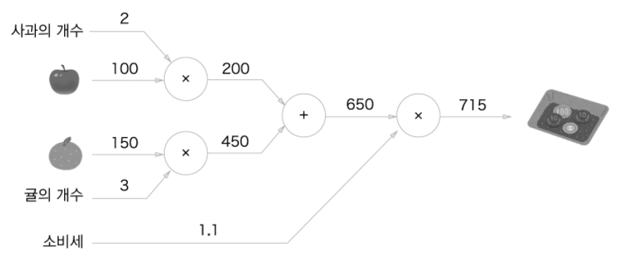   

계산 그래프를 이용한 문제 풀이는 다음 흐름으로 진행됨

1. 계산 그래프를 구성한다
2. 그래프에서 계산을 왼쪽에서 오른쪽으로 진행한다
3. 계산을 왼쪽에서 오른쪽으로 진행하는 단계를 `순전파(forward propagation)`

순전파는 계산 그래프의 출발점부터 종착점으로의 전파   
오르쪽에서 왼쪽으로의 전파가 `역전파(backward propagation)`   
역전파는 이후 `미분을 계산`할 때 중요한 역할   

### 국소적 계산

계산 그래프의 특징은 국소적 계산을 전파함으로써 최종 결과를 얻는다는 점   
국소적 : 자신과 직접 관계된 작은 범위   
국소적 계산은 전체에서 어떤 일이 벌어지든 상관없이 `자신과 관계된 정보`만으로 `결과를 출력`할 수 있음   

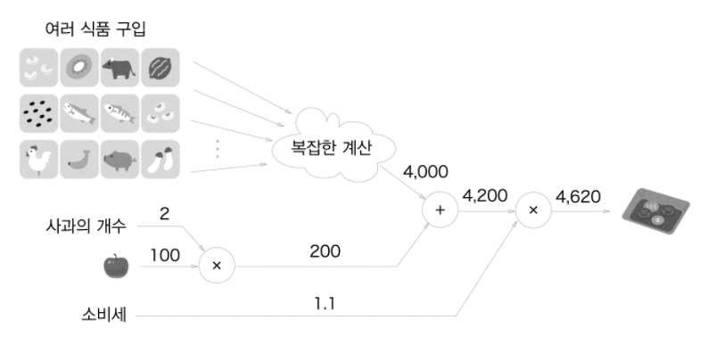   

계산 그래프의 각 노드에서의 계산은 `국소적`   
계산 그래프는 `국소적 계산`에 집중   
전체 계산이 아무리 복잡하더라도 각 단계에서 하는 일은 `해당 노드의 국소적 계산`   
국소적인 계산은 단순하지만, 그 결과를 전달함으로써 `전체를 구성하는 복잡한 계산` 가능   

### 계산 그래프로 푸는 이유

계산그래프의 장점
- 국소적 계산을 통해 각 노드의 계산에 집중하여 문제를 단순화할 수 있다
- 역전파를 통해 '미분'을 효율적으로 계산할 수 있다

'사과 가격이 오르면 최종 금액에 어떠한 영향을 주는가'에 대해서 사과 가격에 대한 지불 금액의 미분을 구해 계산할 수 있음   
사과의 값을 `x`​, 지불 금액을 ​`L`라 했을 때, ​`dL/dx`를 구하는 것   
이러한 미분 값은 사과 값(​x)가 '아주 조금'올랐을 때 지불 금액(L​)이 얼마나 증가하는지를 나타냄   

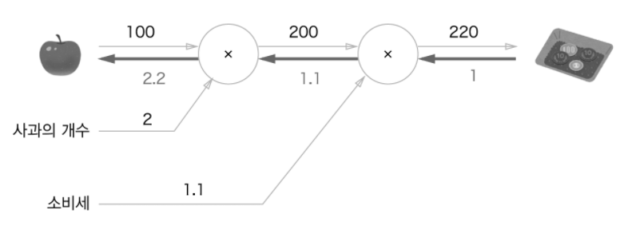   

---

## 연쇄 법칙(Chain Rule)

### 계산 그래프의 역전파

국소적 미분을 전달하는 원리는 연쇄법칙 chain rule 에 따른 것   

**예제 문제**   
y = f(x)의 역전파 계산   

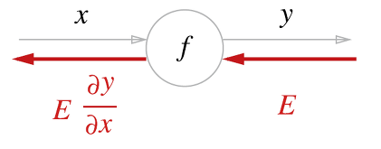   

역전파 계산 순서는 신호E ​에 노드(f​)의 국소적 미분(dy/dx)​을 곱한 후 엣지(edge)를 통해 다음 노드로 전달하는 것
국소적 미분은 순전파 때의 ​y = f(x)에 대한 미분을 구하는 것   
x​에 대한 y​의 미분(dy/dx)을 구한다는 의미   

### 연쇄 법칙이란?

합성함수의 미분은 합성 함수를 구성하는 각 함수의 미분의 곱   

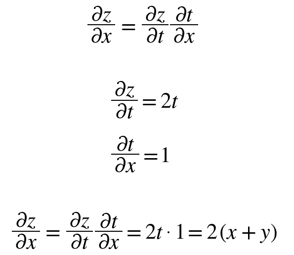   

계산그래프로는 다음과 같다

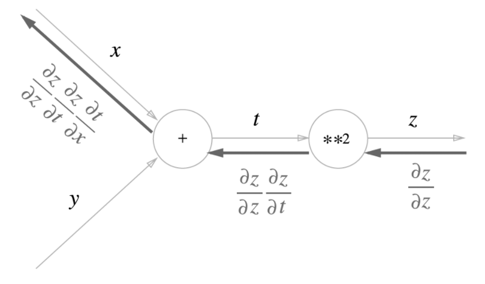   

역전파의 계산 절차
1. 노드로 들어온 입력 신호에 그 노드의 국소적 미분(편미분)을 곱
2. 다음 노드로 전달

---

## 역전파(Backpropagation)

### 덧셈 노드의 역전파

입력값을 그대로 흘려보냄`(gradient distributor)`

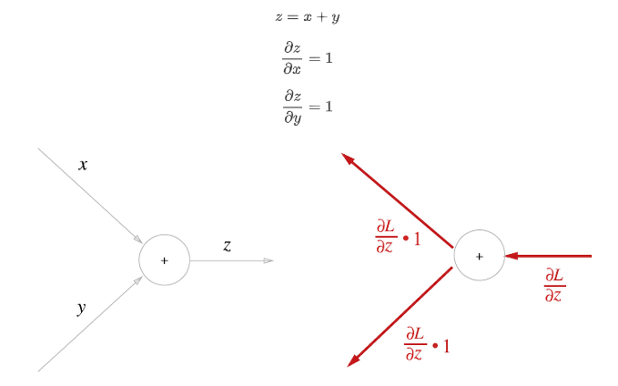   

### 곱셈 노드의 역전파

입력값의 위치를 서로 바꾼 다음 곱해서 흘려보냄`(gradient switcher)`

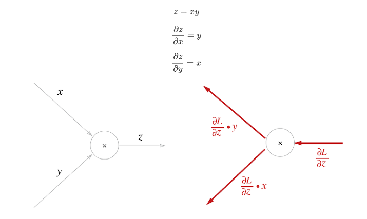   

---

## 단순 계층 구현

### 곱셈 계층

```python
class MulLayer:
    def __init__(self):
        self.x = None
        self.y = None
        
    # 순전파
    def forward(self, x, y):
        self.x = x
        self.y = y
        out = x * y
        
        return out
    
    # 역전파
    def backward(self, dout):
        dx = dout * self.y  # x와 y를 바꾼다.
        dy = dout * self.x
        
        return dx, dy
```

**예제 문제**   
사과 문제에 대한 단순 계층 구현   

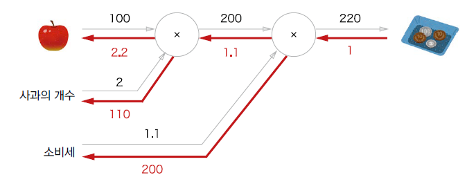   


```python
apple = 100
apple_num = 2
tax = 1.1
​
# 계층들
mul_apple_layer = MulLayer()
mul_tax_layer = MulLayer()
​
# 순전파
apple_price = mul_apple_layer.forward(apple, apple_num)
price = mul_tax_layer.forward(apple_price, tax)
​
print('%d' % price)
​
# 역전파
dprice = 1
dapple_price, dtax = mul_tax_layer.backward(dprice)
dapple, dapple_num = mul_apple_layer.backward(dapple_price)
​
print("%.1f, %d, %d" % (dapple, dapple_num, dtax))
```

```
220
2.2, 110, 200
```

### 덧셈 계층

```python
class AddLayer:
    def __init__(self):
        pass
    
    # 순전파
    def forward(self, x, y):
        out = x + y
        return out
    
    # 역전파
    def backward(self, dout):
        dx = dout * 1
        dy = dout * 1
        return dx, dy
```

**예제 문제**   
사과, 오렌지 문제에 대한 단순 계층 구현   

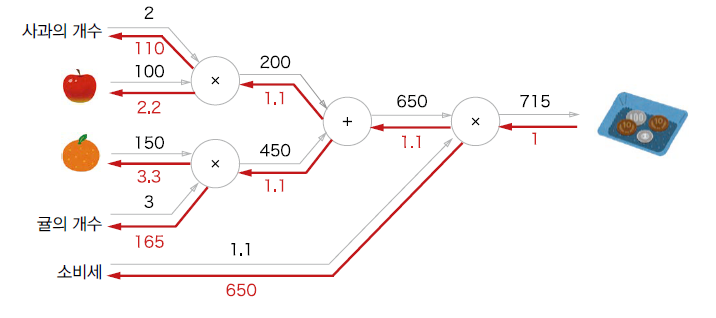   

```python
apple = 100
apple_num = 2
tax = 1.1
​
# 계층들
mul_apple_layer = MulLayer()
mul_tax_layer = MulLayer()
​
# 순전파
apple_price = mul_apple_layer.forward(apple, apple_num)
price = mul_tax_layer.forward(apple_price, tax)
​
print('%d' % price)
​
# 역전파
dprice = 1
dapple_price, dtax = mul_tax_layer.backward(dprice)
dapple, dapple_num = mul_apple_layer.backward(dapple_price)
​
print("%.1f, %d, %d" % (dapple, dapple_num, dtax))
```

```
715
110, 2.2, 3.3, 165, 650
```

---

## 활성화 함수 계층 구현

### ReLU 계층

   
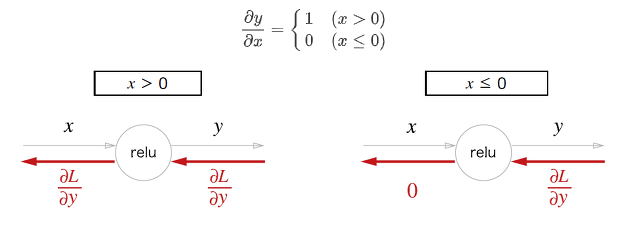   

```python
class Relu:
    def __init__(self):
        self.mask = None
    
    # 순전파
    def forward(self, x):
        self.mask = (x <= 0)
        out = x.copy()
        out[self.mask] = 0
        
        return out
    
    # 역전파
    def backward(self, dout):
        dout[self.mask] = 0
        dx = dout
        
        return dx
```

Relu 계층은 mask 라는 인스턴스 변수를 가짐   
mask는 True/False 로 구성된 넘파일 배열   
순전파의 입력인 x원소 값이 0이하인 인덱스는 True, 그 외 0보다 큰 원소는 False 로 유지   

```python
x = np.array([[1., -.5], 
              [-2., 3.]])
print('x:\n', x)
​
mask = (x <= 0)
print('mask:\n', mask)
```

```
x:
 [[ 1.  -0.5]
 [-2.   3. ]]
mask:
 [[False  True]
 [ True False]]
```

| Relu 계층은 전기 회로의 스위치에 비유할 수 있다
| 순전파 때 전류가 흐르고 있으면 스위치를 On 으로 하고,
| 흐르지 않으면 Off 로 한다
| 역전파 때는 스위치가 On 이라면 전류가 그대로 흐르고,
| Off 이면 더 이상 흐르지 않는다

### Sigmoid 계층

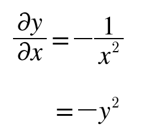   
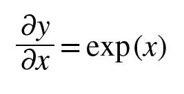   
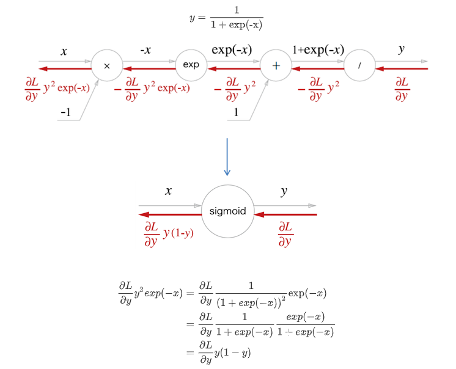   

```python
class Sigmoid:
    def __init__(self):
        self.out = None

    # 순전파    
    def forward(self, x):
        out = 1 / (1 + np.exp(-x))
        self.out = out
        
        return out
    
    # 역전파
    def backward(self, dout):
        dx = dout * (1.0 - self.out) * self.out
        
        return dx
```

---

## Affne, Softmax 계층 구현

### Affine 계층

Affine transformation : 순전파 때 수행하는 행렬의 곱

#### 단일 데이터용

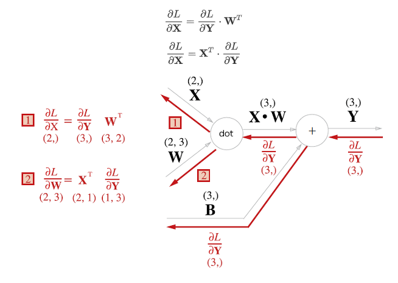   

#### 배치용

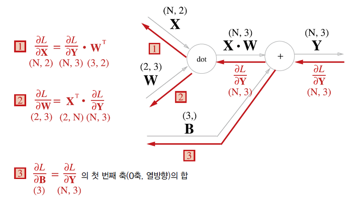   

```python
class Affine:
    def __init__(self, W, b):
        self.W = W
        self.b = b
        self.x = None
        self.dW = None
        self.db = None

    # 순전파    
    def forward(self, x):
        self.x = x
        out = np.dot(x, self.W) + self.b
        
        return out
    
    # 역전파
    def backward(self, dout):
        dx = np.dot(dout, self.W.T)
        self.dW = np.dot(self.x.T, dout)
        self.db = np.sum(dout, axis=0)
        
        return dx
```

### Softmax-with-Loss 계층

딥러닝에서는 학습과 추론 두 가지가 존재   
일반적으로 추론일 때는 Softmax 계층(layer)을 사용하지 않음   
Softmax 계층 앞의 Affine 계층의 출력을 점수(score)   
딥러닝의 추론에서는 답을 하나만 예측하는 경우에는 가장 높은 점수만 알면 되므로 Softmax 계층이 필요   
딥러닝을 학습할 때는 Softmax 계층이 필요   

   

Softmax 계층을 구현할 때, 손실함수인 교차 엔트로피 오차(cross entropy error)도 포함하여 계층 구현

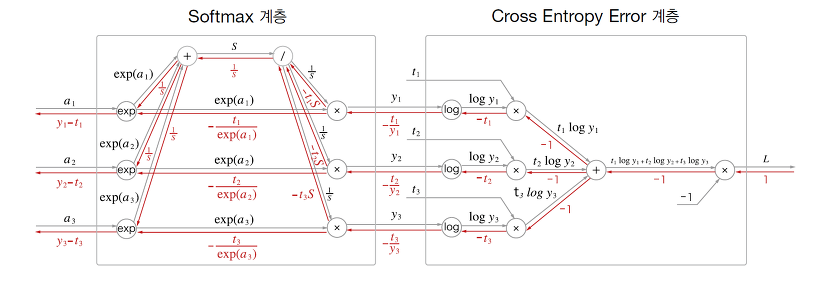   

```python
class SoftmaxWithLoss:
    def __init__(self):
        self.loss = None  # 손실
        self.y = None  # softmax의 출력
        self.t = None  # 정답 레이블(one-hot)
        
    def forward(self, x, t):
        self.t = t
        self.y = softmax(x)
        self.loss = cross_entropy_error(self.y, self.t)
        return self.loss
    
    def backward(self, dout=1):
        batch_size = self.shape[0]
        dx = (self.y - self.t) / batch_size
        
        return dx
```

---

## Backpropagation(오차역전파법) 구현

### 신경망 학습의 전체 그림

딥러닝은 `손실함수의 값이 최소`로 되도록 `가중치`와 `편향인 매개변수`를 `조정하는 과정`을 `학습`이라고 표현
1. 미니배치(mini-batch) : Train 데이터 중 랜덤하게 샘플을 추출하는데 이것을 미니배치라고 하며, 미니배치의 손실함수 값을 줄이는 것이 학습의 목표
2. 기울기 계산 : 손실함수의 값을 작게하는 방향을 가리키는 가중치(W​) 매개변수의 기울기를 구함
3. 매개변수 갱신 : 가중치 매개변수를 기울기 방향으로 학습률(learning rate)만큼 갱신
4. 반복 1~3 단계를 반복

### Backpropagation을 적용한 신경망 구현

```python
class TwoLayerNet:
    '''2층 신경망 구현'''
    def __init__(self, input_size, 
                 hidden_size, output_size, weight_init_std=0.01):
        '''
        초기화 수행
        Params:
            - input_size: 입력층 뉴런 수
            - hidden_size: 은닉층 뉴런 수
            - output_size: 출력층 뉴런 수
            - weight_init_std: 가중치 초기화 시 정규분포의 스케일
        '''
        # 가중치 초기화
        self.params = {
            'W1': weight_init_std * np.random.randn(input_size, hidden_size),
            'b1': np.zeros(hidden_size),
            'W2': weight_init_std * np.random.randn(hidden_size, output_size),
            'b2': np.zeros(output_size)
        }
        
        # 계층 생성
        self.layers = OrderedDict({
            'Affine1': Affine(self.params['W1'], self.params['b1']),
            'Relu1': Relu(),
            'Affine2': Affine(self.params['W2'], self.params['b2'])
        })
        
        self.last_layer = SoftmaxWithLoss()
        
    
    def predict(self, x):
        '''예측(추론)
            Pararms:
                - x: 이미지 데이터'''
        for layer in self.layers.values():
            x = layer.forward(x)
            
        return x
    
    def loss(self, x, t):
        '''
        손실함수의 값을 계산
        Params:
            - x: 이미지데이터, t: 정답 레이블
        '''
        y = self.predict(x)
        return self.last_layer.forward(y, t)
    
    def accuracy(self, x, t):
        '''
        정확도 계산
        Params:
            - x: 이미지 데이터
            - t: 정답 레이블
        '''
        y = self.predict(x)
        y = np.argmax(y, axis=1)
        if t.ndim != 1:
            t = np.argmax(t, axis=1)
        
        accuracy = np.sum(y==t) / float(x.shape[0])
        return accuracy
    
    
    def numerical_gradient(self, x, t):
        '''
        미분을 통한 가중치 매개변수의 기울기 계산
        Params:
            - x: 이미지 데이터
            - t: 정답 레이블 
        '''
        loss_W = lambda W: self.loss(x, t)
        
        grads = {
            'W1': numerical_gradient(loss_W, self.params['W1']),
            'b1': numerical_gradient(loss_W, self.params['b1']),
            'W2': numerical_gradient(loss_W, self.params['W2']),
            'b2': numerical_gradient(loss_W, self.params['b2'])
        }
        return grads
    
    def gradient(self, x, t):
        # forward
        self.loss(x, t)
        
        # backward
        dout = 1
        dout = self.last_layer.backward(dout)
        
        layers = list(self.layers.values())
        layers.reverse()
        for layer in layers:
            dout = layer.backward(dout)
            
        # 결과 저장
        grads = {
            'W1': self.layers['Affine1'].dW, 'b1': self.layers['Affine1'].db,
            'W2': self.layers['Affine2'].dW, 'b2': self.layers['Affine2'].db
        }
        return grads
```

### Backpropagation으로 구한 기울기 검증

수치 미분을 통해 구한 기울기와 Backpropagation의 결과를 비교하여 Backpropagation을 제대로 구현했는지 검증하는 작업을 `기울기 확인(gradient check)`

```python
%%time
# gradient_check.py
import sys, os
sys.path.append(os.pardir)
import numpy as np
from dataset.mnist import load_mnist
​
# mnist load
(x_train, t_train), (x_test, t_test) = load_mnist(normalize=True)
​
network = TwoLayerNet(input_size=28*28, hidden_size=50, output_size=10)
​
x_batch = x_train[:3]
t_batch = t_train[:3]
​
grad_numerical = network.numerical_gradient(x_batch, t_batch)
grad_backprop = network.gradient(x_batch, t_batch)
​
# 각 가중치의 절대 오차의 평균을 구한다.
for key in grad_numerical.keys():
    diff = np.average(np.abs(grad_backprop[key] - grad_numerical[key]))
    print(key,":", str(diff))
```

```
W1 : 4.479721446541244e-10
b1 : 2.5485543061868916e-09
W2 : 4.349602602871501e-09
b2 : 1.393278526204411e-07
Wall time: 6.78 s
```

### Backpropagation을 사용한 학습 구현

```python
%%time
# train_neuralnet.py
import sys, os
sys.path.append(os.pardir)
import numpy as np
from dataset.mnist import load_mnist
​
# mnist load
(x_train, t_train), (x_test, t_test) = load_mnist(normalize=True)
​
network = TwoLayerNet(input_size=28*28, hidden_size=50, output_size=10)
​
# Train Parameters
iters_num = 10000
train_size = x_train.shape[0]
batch_size = 100
learning_rate = 0.1
iter_per_epoch = max(train_size / batch_size, 1)
​
train_loss_list, train_acc_list, test_acc_list = [], [], []
​
for step in range(1, iters_num+1):
    # get mini-batch
    batch_mask = np.random.choice(train_size, batch_size)
    x_batch = x_train[batch_mask]
    t_batch = t_train[batch_mask]
    
    # 기울기 계산
    #grad = network.numerical_gradient(x_batch, t_batch) # 수치 미분 방식
    grad = network.gradient(x_batch, t_batch) # 오차역전파법 방식(압도적으로 빠르다)
    
    # Update
    for key in ('W1', 'b1', 'W2', 'b2'):
        network.params[key] -= learning_rate * grad[key]
        
    # loss
    loss = network.loss(x_batch, t_batch)
    train_loss_list.append(loss)
    
    if step % iter_per_epoch == 0:
        train_acc = network.accuracy(x_train, t_train)
        test_acc = network.accuracy(x_test, t_test)
        train_acc_list.append(train_acc)
        test_acc_list.append(test_acc)
        print('Step: {:4d}\tTrain acc: {:.5f}\tTest acc: {:.5f}'.format(step, 
                                                                        train_acc,
                                                                        test_acc))
        
print('Optimization finished!')
```

```
Step:  600  Train acc: 0.90450  Test acc: 0.90560
Step: 1200  Train acc: 0.92288  Test acc: 0.92570
Step: 1800  Train acc: 0.93220  Test acc: 0.93200
Step: 2400  Train acc: 0.94605  Test acc: 0.94460
Step: 3000  Train acc: 0.95430  Test acc: 0.95210
Step: 3600  Train acc: 0.95993  Test acc: 0.95870
Step: 4200  Train acc: 0.96360  Test acc: 0.95870
Step: 4800  Train acc: 0.96682  Test acc: 0.96320
Step: 5400  Train acc: 0.96930  Test acc: 0.96380
Step: 6000  Train acc: 0.97108  Test acc: 0.96450
Step: 6600  Train acc: 0.97318  Test acc: 0.96690
Step: 7200  Train acc: 0.97557  Test acc: 0.96890
Step: 7800  Train acc: 0.97698  Test acc: 0.96760
Step: 8400  Train acc: 0.97808  Test acc: 0.96990
Step: 9000  Train acc: 0.97835  Test acc: 0.97030
Step: 9600  Train acc: 0.98035  Test acc: 0.97020
Optimization finished!
Wall time: 26.6 s
```

---

## 정리

- 계산 그래프를 이용하면 계산 과정을 시각적으로 파악할 수 있다
- 계산 그래프의 노드는 국소적 계산으로 구성된다. 국소적 계산을 조합해 전체 계산을 구성한다
- 계산 그래프의 순전파는 통상의 계산을 수행한다. 한편, 계산 그래프의 역전파로는 각 노드의 미분을 구할수 있다
- 신경망의 구성 요소를 계층으로 구현하여 기울기를 효율적으로 계산할 수 있다(오차역전파법)
- 수치 미분과 오차역전파법의 결과를 비교하면 오차역전파법의 구현에 잘못이 없는지 확인할 수 있다(기울기 확인)